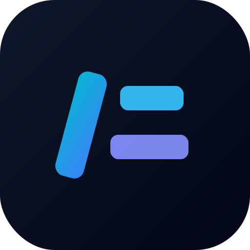

<p align="center">
  
</p>

<h1 align="center">云简 · 执笔云上，简纳万千</h1>

<p align="center">纯文件系统驱动的轻量级 Markdown 笔记 / 文档管理系统。专为 NAS 极客与开发者设计。</p>

- **✨ 内置 AI 助手**：接入任意 OpenAI 兼容大模型（DeepSeek / MiniMax / OpenAI / 本地 Ollama），选中文本即可润色 / 总结 / 续写 / 纠错，或 `/ai` 自由提问。模型 Key 仅存服务端，绝不暴露给前端。
- **零数据库**：不依赖 MySQL / SQLite，所有数据以纯 `.md` 文本与原始目录层级直接落盘。
- **100% 数据主权**：笔记就是你硬盘上的普通文件，任意同步盘 / `rsync` / Git 即可备份。
- **本地优先 (Local-first)**：私人部署，极简 JWT 鉴权。

## ✨ AI 助手（可选 · 接入任意大模型）

编辑器内置 AI：选中文本点 AI 按钮即可**润色 / 总结 / 续写 / 纠错**，或输入 `/ai` 自由提问；模型流式写入文档，结果可一键接受或撤销。

- **任意 OpenAI 兼容模型**：DeepSeek、MiniMax、OpenAI、Moonshot、本地 Ollama / LM Studio 等都能接。
- **Key 不出服务端**：浏览器 → 你的后端代理 → 模型提供商，API Key 只存在于容器环境变量，前端永远拿不到。
- **未配置即无 AI**：留空以下三个变量，编辑器与普通版完全一致，零影响。

只需在 `.env` 或 `docker-compose.yml` 填三行（任选一家提供商）：

| 提供商 | `AI_BASE_URL` | `AI_MODEL` 示例 |
| --- | --- | --- |
| DeepSeek | `https://api.deepseek.com/v1` | `deepseek-chat` |
| MiniMax | `https://api.minimaxi.com/v1` | `MiniMax-M2.7` |
| OpenAI | `https://api.openai.com/v1` | `gpt-4o-mini` |
| 本地 Ollama | `http://<nas-ip>:11434/v1` | `qwen2.5` |

> ⚠️ MiniMax 务必用 `/v1`（OpenAI 兼容端点），**不要**用 `/anthropic`。

## 技术栈

| 层 | 选型 |
| --- | --- |
| 语言 | TypeScript (全栈) |
| 后端 | Node.js + Express |
| 前端 | React + Ant Design + Tailwind CSS |
| 编辑器 | BlockNote + BlockNote AI（`@blocknote/xl-ai`） |
| 构建 | Vite (前端) · tsc (后端) |
| 部署 | Docker · docker-compose |

## 目录结构

```
cloudnote/
├── server/            # @cloudnote/server — Express API + 文件系统操作
├── web/               # @cloudnote/web    — Vite + React 前端
├── pnpm-workspace.yaml
├── docker-compose.yml
└── Dockerfile         # 多阶段构建：编译前端 → 单容器提供静态资源 + API
```

## 快速开始 (开发)

```bash
# 1. 安装依赖
pnpm install

# 2. 准备环境变量
cp .env.example .env        # 按需修改，尤其 ROOT_SPACE / NAS_PASSWORD

# 3. 同时启动前后端 (Vite 5173 + Express 3130)
pnpm dev
```

## 快速开始 (Docker)

```bash
cp .env.example .env
docker compose up -d --build
# 访问 http://<NAS-IP>:3130
```

## 部署到 NAS（推荐 · 一键 docker compose）

适用：群晖 / 威联通 / unRAID / 其他能跑 Docker 的 NAS 或 Linux 小主机。镜像已发布到 Docker Hub（`qazzxxx/cloudnotes`），**无需本地构建**。

```yaml
# 云简 CloudNote —— NAS 一键部署配置
services:
  cloudnote:
    image: qazzxxx/cloudnotes:latest   # 启动后会自动拉最新镜像
    container_name: cloudnote
    restart: unless-stopped
    ports:
      - "3130:3130"                    # 左侧是宿主机端口，按需改
    environment:
      NODE_ENV: production
      ROOT_SPACE: /data/notes
      PORT: "3130"
      # 🔧 1. 把 qaz123 改成你自己的访问密码（首次登录用）
      NAS_PASSWORD: "your_secure_password_here"
      # 🔧 2. 强烈建议填一个长随机串（openssl rand -hex 32）。
      #       留空 = 后端启动时随机生成，容器重启后所有 token 失效。
      JWT_SECRET: ""
      JWT_EXPIRES_HOURS: "72"
      CORS_ORIGIN: ""
      # ── AI 助手（可选，OpenAI 兼容）── 三项都填才启用；留空 = 编辑器无 AI。Key 仅存服务端。
      # DeepSeek 示例：AI_BASE_URL=https://api.deepseek.com/v1 / AI_MODEL=deepseek-chat
      # MiniMax 示例：AI_BASE_URL=https://api.minimaxi.com/v1 / AI_MODEL=MiniMax-M2.7
      AI_BASE_URL: ""
      AI_API_KEY: ""
      AI_MODEL: ""
    volumes:
      # 🔧 3. 左侧改为你 NAS 上实际存放笔记的目录（与步骤 1 一致）
      - ./notes:/data/notes
```

### 备份 / 迁移

整份笔记 = 宿主机挂载目录里的 `.md` + `assets/`。`tar` / `rsync` / Synology Hyper Backup 任意一种都能备份：

```bash
tar -czf cloudnotes-backup-$(date +%Y%m%d).tar.gz /volume1/docker/cloudnotes/notes
```
